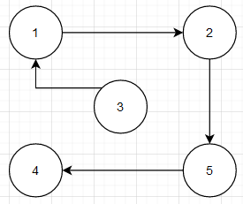

# Distanciel : Algorithmes Approchés pour deux problèmes d'optimisation : Max-SGC et MIN MAKESPAN #

## 1. Le problème MAX-SGC est un problème d'optimisation. Écrire, sous la forme NOM/INSTANCE/QUESTION le problème de décision associé à MAX-SGC.
    DEC-SGC
    Instance : Un graphe orienté G = (V,A), un entier k.
    Question : Possède t-il un sous-graphe sans circuit avec k sommets?
## 2. Démontrer que DEC-SGC est dans NP.

Certificat : un graphe G' qui est un sous-graphe de G qui ne possède pas de circuit.

Taille des donnée : |G'| est la taille du certificat. Donc la taille du certificat est polynomial.

Vérification : 

- G' possède bien k sommets et qu'ils appartiennent au graphe G => O(n+n²) = O(n)
- G' ne possède pas de circuit O( k*m + m² ) avec m le nombre d'Arc
  
    Ainsi la vérification se fait en temps polynomial.

La taille du certificat et la verification sont polynomiales donc on peut conclure que DEC-SGC est dans NP.

## 3. Appliquer l'algorithme Approx-SGC sur le graphe orienté ci-dessus, en utilisant la numérotation des sommets qui y est indiquée. En particulier, indiquer les contenus de A1, A2 et A'

### A) Attribution aux hasards des sommets :

La valeur des sommets est deja attribué tel que 1<=p<=n donc on garde cette attribution de G.

### B) Séparation des Arcs dans l'ensemble A1 ou A2.

| A1    | A2    |
| ----- | ----- |
| (1,4) | (4,3) |
| (1,7) | (7,5) |
| (3,7) | (3,2) |
| (2,5) | (7,6) |
| (5,8) | (6,1) |
|       | (8,6) |

### C) L'ensemble qui contient le plus d'Arcs est l'ensemble A2 donc A' = A2.

## 4.  Montrer que, quel que soit le graphe orienté G donné en entrée, les arcs de l'ensemble A' calculé par Approx-SGC ne forment jamais de circuit.

## 5. Approx-SGC est-il polynomial ? Justifier.

- Partie A : O( n ), parcours tous les sommets.
- Partie B : O( n² ), parcours tous les Arcs et ajoute dans les sommets A1 ou A2.
- Partie C : O( n ), parcours l'ensemble A le plus grand.
  Donc pour tous les parties, le temps est polynomial ainsi Approx-SGC est polynomial.

## 6. Proposer un exemple de graphe orienté G à n = 5 sommets pour lequel Approx-SGC ne fournit pas une solution optimale au problème MAX-SGC. Justifier.

Il y a autant d'ensemble A1 que A2 ainsi Approx-SGC ne fournit pas une solution optimale sans graphe. Car la solution optimal du graphe est tout les sommets soit 5.

## 7. Pour tout graphe orienté G, donner une borne supérieure pour opt(G), qui dépend de m (le nombre d'arcs du graphe). Justifier.

La borne maximum est un graphe qui ne possède pas de circuit ainsi opt(G) est m. m qui est le nombre d'Arcs.

$$ {opt(G)}\leq{m} $$

## 8. Pour tout graphe orienté G, donner une borne inférieure pour sol(G), qui dépend aussi de m. Justifier.

La borne inférieur pour sol(G) est :

$$ {sol(G)=}\geq{\frac{m}{2}} $$
Car l'algorithme Approx-SGC partage les arrêtes en deux parties puis on choisit la plus grande partie. Ainsi le plus petit ensemble possède donc la moitié des arrêtes.

 $$ {sol(G)}\geq{\frac{m}{2}} $$

## 9. En déduire un ratio d'approximation pour l'algorithme Approx-SGC.

On a :

$$ \frac{m}{2}\geq{opt(G)}{\geq{m}} $$

Ainsi le ratio d'approximation est de 2.

## 10. Quel ratio d'approximation est obtenu par Approx-SGC sur le graphe orienté de la figure ? Justifier.

 La figure possède 11 arrêtes , l'ensemble le plus grand possède 6 éléments.
 
 Donc :  
 $$ ratio=\frac{11}{6}=1.83 $$ 