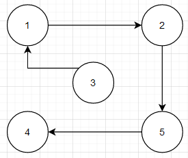

# Distanciel : Algorithmes Approchés pour deux problèmes d'optimisation : Max-SGC et MIN MAKESPAN #
Ismael BENBRIK et Malo GRALL

## Partie 1 : le problème Max-SGC
### 1. Le problème MAX-SGC est un problème d'optimisation. Écrire, sous la forme NOM/INSTANCE/QUESTION le problème de décision associé à MAX-SGC.
    DEC-SGC
    Instance : Un graphe orienté G = (V,A), un entier k.
    Question : Possède t-il un sous-graphe sans circuit avec k sommets?
### 2. Démontrer que DEC-SGC est dans NP.

Certificat : un graphe G' qui est un sous-graphe de G qui ne possède pas de circuit.

Taille des donnée : |G'| est la taille du certificat. Donc la taille du certificat est polynomial.

Vérification : 

- G' possède bien k sommets et qu'ils appartiennent au graphe G => O(n+n²) = O(n)
- G' ne possède pas de circuit O( k*m + m² ) avec m le nombre d'Arc
  
    Ainsi la vérification se fait en temps polynomial.

La taille du certificat et la verification sont polynomiales donc on peut conclure que DEC-SGC est dans NP.

### 3. Appliquer l'algorithme Approx-SGC sur le graphe orienté ci-dessus, en utilisant la numérotation des sommets qui y est indiquée. En particulier, indiquer les contenus de A1, A2 et A'

#### A) Attribution aux hasards des sommets :

La valeur des sommets est deja attribué tel que 1<=p<=n donc on garde cette attribution de G.

#### B) Séparation des Arcs dans l'ensemble A1 ou A2.

| A1    | A2    |
| ----- | ----- |
| (1,4) | (4,3) |
| (1,7) | (7,5) |
| (3,7) | (3,2) |
| (2,5) | (7,6) |
| (5,8) | (6,1) |
|       | (8,6) |

#### C) L'ensemble qui contient le plus d'Arcs est l'ensemble A2 donc A' = A2.

### 4.  Montrer que, quel que soit le graphe orienté G donné en entrée, les arcs de l'ensemble A' calculé par Approx-SGC ne forment jamais de circuit.

### 5. Approx-SGC est-il polynomial ? Justifier.

- Partie A : O( n ), parcours tous les sommets.
- Partie B : O( n² ), parcours tous les Arcs et ajoute dans les sommets A1 ou A2.
- Partie C : O( n ), parcours l'ensemble A le plus grand.
  Donc pour tous les parties, le temps est polynomial ainsi Approx-SGC est polynomial.

### 6. Proposer un exemple de graphe orienté G à n = 5 sommets pour lequel Approx-SGC ne fournit pas une solution optimale au problème MAX-SGC. Justifier.

Il y a autant d'ensemble A1 que A2 ainsi Approx-SGC ne fournit pas une solution optimale sans graphe. Car la solution optimal du graphe est tout les sommets soit 5.

### 7. Pour tout graphe orienté G, donner une borne supérieure pour opt(G), qui dépend de m (le nombre d'arcs du graphe). Justifier.

La borne maximum est un graphe qui ne possède pas de circuit ainsi opt(G) est m. m qui est le nombre d'Arcs.

$$ {opt(G)}\leq{m} $$

### 8. Pour tout graphe orienté G, donner une borne inférieure pour sol(G), qui dépend aussi de m. Justifier.

La borne inférieur pour sol(G) est :

$$ {sol(G)=}\geq{\frac{m}{2}} $$
Car l'algorithme Approx-SGC partage les arrêtes en deux parties puis on choisit la plus grande partie. Ainsi le plus petit ensemble possède donc la moitié des arrêtes.

 $$ {sol(G)}\geq{\frac{m}{2}} $$

### 9. En déduire un ratio d'approximation pour l'algorithme Approx-SGC.

On a :

$$ \frac{m}{2}\geq{opt(G)}{\geq{m}} $$

Ainsi le ratio d'approximation est de 2.

### 10. Quel ratio d'approximation est obtenu par Approx-SGC sur le graphe orienté de la figure ? Justifier.

 La figure possède 11 arrêtes , l'ensemble le plus grand possède 6 éléments.
 
 Donc :  
 $$ ratio=\frac{11}{6}=1.83 $$ 

## Partie 2 : le problème MIN MAKESPAN
### 1. Complexité en temps et au pire de la génération des instances

### 2. Complexité en temps et au pire de chacun des trois algorithmes

### 3. Campagne de tests pour l'algorithme LSA avec les instances de type Ip
| p  | ratio LSA   | p  | ratio LSA   | p   | ratio LSA   |
| -- | ----------- | -- | ----------- | --- | ----------- |
| **1**  | 1.333333333 | **15** | 1.935483871 | **70** | 1.985815603 |
| **2**  | 1.6         | **20** | 1.951219512 | **80** | 1.98757764  |
| **3**  | 1.714285714 | **25** | 1.960784314 | **90** | 1.988950276 |
| **4**  | 1.777777778 | **30** | 1.967213115 | **100** | 1.990049751 |
| **5**  | 1.818181818 | **35** | 1.971830986 | **120** | 1.991701245 |
| **6**  | 1.846153846 | **40** | 1.975308642 | **140** | 1.992882562 |
| **7**  | 1.866666667 | **45** | 1.978021978 | **160** | 1.99376947  |
| **8**  | 1.882352941 | **50** | 1.98019802  | **180** | 1.994459834 |
| **9**  | 1.894736842 | **55** | 1.981981982 | **200** | 1.995012469 |
| **10** | 1.904761905 | **60** | 1.983471074 | **300** | 1.996672213 |

### 4. Que remarquez-vous en ce qui concerne le ratio LSA sur les instances de type Ip quand p grandit ? Pouvez-vous fournir une explication à cette observation ?
On remarque que le ratio se rapproche rapidement de 2 et ne dépasse pas 2, même avec `p = 300`. Le ratio est déjà à environ `1.8` pour `p = 8`.

Plus p est grand, plus la différence entre la dernière tâche (2p) est grande, ce qui fait qu'en l'affectant à une machine en dernier, à la première, on se retrouve avec une machine ayant la même durée que les autres machines, plus `2p`. 

2p étant bien plus grand que toutes les autres durées de tâches, sa valeur écrase le reste, d'où le ratio de 2.

### 5. Campagne de tests pour l'algorithme LPT avec les instances de type Ip
| p  | ratio LSA | p  | ratio LSA | p   | ratio LSA |
| -- | --------- | -- | --------- | --- | --------- |
| **1**  | 1         | **15** | 1         | **70**  | 1         |
| **2**  | 1         | **20** | 1         | **80**  | 1         |
| **3**  | 1         | **25** | 1         | **90**  | 1         |
| **4**  | 1         | **30** | 1         | **100** | 1         |
| **5**  | 1         | **35** | 1         | **120** | 1         |
| **6**  | 1         | **40** | 1         | **140** | 1         |
| **7**  | 1         | **45** | 1         | **160** | 1         |
| **8**  | 1         | **50** | 1         | **180** | 1         |
| **9**  | 1         | **55** | 1         | **200** | 1         |
| **10** | 1         | **60** | 1         | **300** | 1         |

### 6. Que remarquez-vous en ce qui concerne le ratio LPT sur les instances de type Ip quand p grandit ?
On constate que le ratio est toujours égal à 1. Ce qui veut dire que la machien avec la plus longue durée, a sa durée égale à la durée de la plus longue tâches.

Ce qui veut dire qu'en affectant la tâches la plus longue en premier, la répartition est idéale, la durée total étant égale à la durée de la plus longue tâche.

Avec une étape en plus on constate que LPT est en moyenne 2 fois plus efficace que LSA.

### 7. Campagne de tests pour l'algorithme RMA avec les instances de type Ip
| p          | ratio LSA   | p          | ratio LSA   | p   | ratio LSA           |
| ---------- | ----------- | ---------- | ----------- | --- | ------------------- |
| **1**  | 1.333333333 | **15** | 1.612903226 | **70**  | 2.042553191 |
| **2**  | 2           | **20** | 1.804878049 | **80**  | 2.198757764 |
| **3**  | 2           | **25** | 2           | **90**  | 2.121546961 |
| **4**  | 2.444444444 | **30** | 1.983606557 | **100** | 2.034825871 |
| **5**  | 1.636363636 | **35** | 2.028169014 | **120** | 1.908713693 |
| **6**  | 1.692307692 | **40** | 1.938271605 | **140** | 1.982206406 |
| **7**  | 1.666666667 | **45** | 1.813186813 | **160** | 2.037383178 |
| **8**  | 1.764705882 | **50** | 1.782178218 | **180** | 2.008310249 |
| **9**  | 2.052631579 | **55** | 2           | **200** | 1.880299252 |
| **10** | 1.761904762 | **60** | 2.090909091 | **300** | 2.03327787  |

On remarque que le ratio est toujours supérieur à 1, et même souvent supérieur à 2. C'est donc l'algorithme le moins efficace en terme de répartition pour ces conditions, pour des instances du type `Ip`.

On ne remarque pas de cas où l'algorithme RMA peut être plus avantageux.

### 8. Exécuter le mode IR sur au moins une trentaine d'exemples différents
